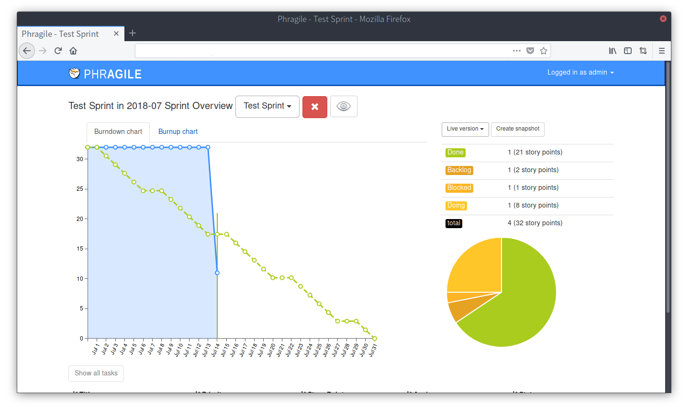

# Phragile

Dockerfile for [Phragile](https://github.com/wmde/phragile) a sprint overviews for [Phabricator](https://phacility.com/phabricator/) projects.

## Prerequisites

- Phabricator (see [details](https://github.com/wmde/phragile/blob/master/README.md#user-content-installation))
- MySQL

## Usage

TL;DR:

    $ docker run --rm \
    -e APP_ENV=local \
    -e APP_DEBUG=true \
    -e APP_KEY=xxxxxxxxxxxxxxxxxxxxxxxxxxxxxxxx \
    -e DB_HOST=phragile-mysql \
    -e DB_DATABASE=phragile \
    -e DB_USERNAME=phragile \
    -e DB_PASSWORD=phragile \
    -e CACHE_DRIVER=file \
    -e SESSION_DRIVER=file \
    -e OAUTH_CLIENT_ID=PHID-OASC-xxxxxxxxxxxxxxxxxxxx \
    -e OAUTH_CLIENT_SECRET=xxxxxxxxxxxxxxxxxxxxxxxxxxxxxxxx \
    -e PHABRICATOR_URL=http://your.phabricator.host/ \
    -e PHRAGILE_BOT_API_TOKEN=api-xxxxxxxxxxxxxxxxxxxxxxxxxxxx \
    -e MANIPHEST_STORY_POINTS_FIELD=points \
    -e PHRAGILE_ADMINS=admin \
    -v $(pwd)/storage:/phragile/storage \
    -p 80:80 \
    --link your.phabricator.host \
    --link phragile-mysql \
    t13a/phragile

### Environment variables

Name | Description | Default | Example
--- | --- | --- | ---
`NO_MIGRATE` | Do not migrate DB at start time. | N/A | `yes`
`NO_PREPARE_STORAGE` | Do not touch `/phragile/storage` at start time. | N/A | `yes`
`SNAPSHOTS_CREATE_SCHEDULE` | Periodically create all active sprint snapshots. | N/A | `0 0 * * *`

